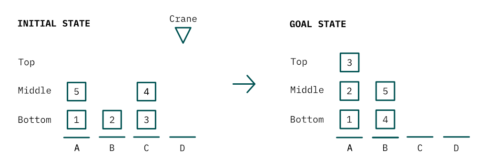
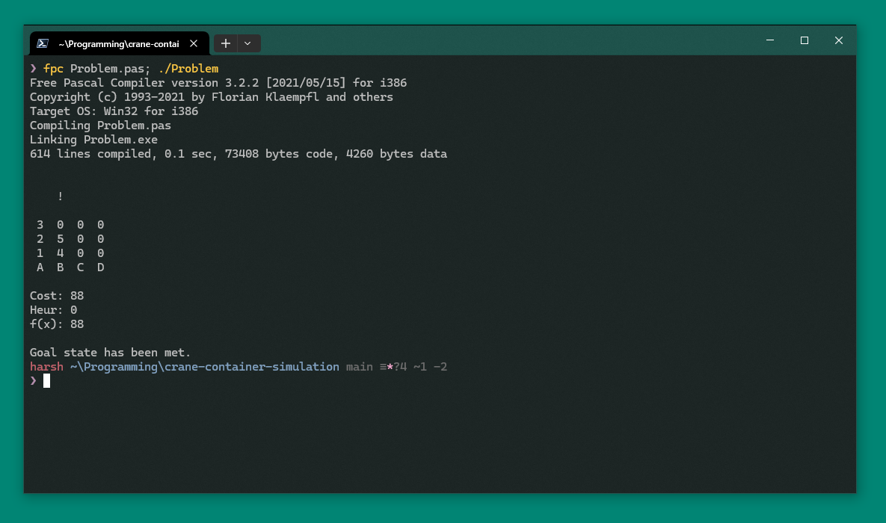

# Crane Container Simulation (CCS)


## Overview

The "Crane Container Simulation" is a terminal application used to aid in the calculation
of heuristics and cost. The goal was to find the shortest possible path to reach the goal
state from the initial state, as per the requirement from the module BS2200 Artificial
Intelligence at the University of Winchester. The Original Hand In Date was Tuesday,
10th of January 2023. **No further development will be pursued.**

## Contextual Information

The scenario involves four loading bays (A-D), five containers (1-5) and a single crane.

* Each loading bay can have a maximum of three containers.
* The crane can only hold one container at a time.
* The crane takes a maximum of four minutes lifting a container - minus the position of
the container (Bottom (0), Middle (1), Top (2)).
* The crane takes three minutes moving between neighbouring bays.
* The crane takes two minutes dropping a container.

Below shows the initial state of the dock and the goal state that must be reached within
minimum time.



## Usage by Editing Code

From Line 334, it shows that operations I took to reach the goal state from the initial
state. This program was create to help out with working out heuristics and the total path
cost, manually using the A* algorithm.

```pas
// Example:
// Increase the Total Cost based on the crane moving from loading bay D to loading bay C.
Inc(TotalCost^, Move(Crane^, LoadingBayD^, LoadingBayC^));


// All functions available to use
// The returning Integer is the cost so it can be used in the increment function with
// the total cost.
// Inc(TotalCost^, { function here });

(* Moves the crane from and to the specified bays. *)
function Move(
    var Crane: TCrane; 
    LoadingBayFrom, LoadingBayTo: TLoadingBay): Integer;

(* Crane picks up the top container from the loading bay *)
function PickUp(
    var Crane: TCrane; var LoadingBay: TLoadingBay;
    var Containers: array of TContainer): Integer;

(* Drops the container the crane is holding *)
function Drop(
    var Crane: TCrane; var LoadingBay: TLoadingBay;
    var Containers: array of TContainer): Integer;

```

## Quick Start

```sh
# Compiling the program.
fpc Problem.pas
# Running the program.
./Problem
```

Below shows the program output.


